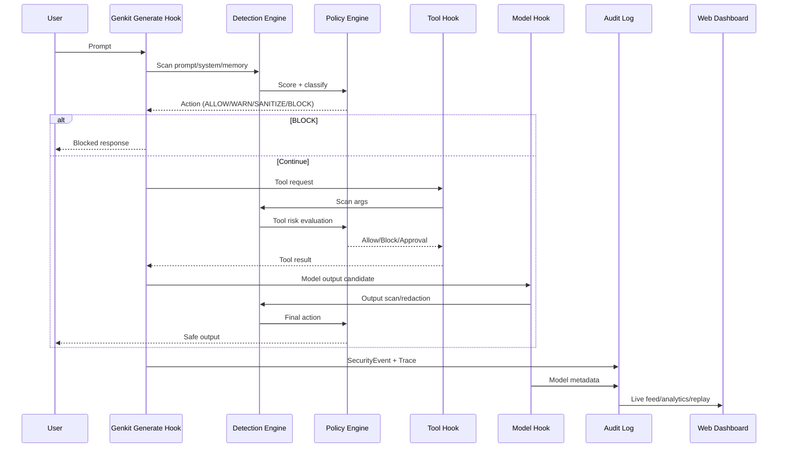

# Sentinel Architecture

```mermaid
sequenceDiagram
  participant U as User
  participant G as Genkit Generate Hook
  participant D as Detection Engine
  participant P as Policy Engine
  participant T as Tool Hook
  participant M as Model Hook
  participant A as Audit Log
  participant W as Web Dashboard

  U->>G: Prompt
  G->>D: Scan prompt/system/memory
  D->>P: Score + classify
  P-->>G: Action (ALLOW/WARN/SANITIZE/BLOCK)
  alt BLOCK
    G-->>U: Blocked response
  else Continue
    G->>T: Tool request
    T->>D: Scan args
    D->>P: Tool risk evaluation
    P-->>T: Allow/Block/Approval
    T-->>G: Tool result
    G->>M: Model output candidate
    M->>D: Output scan/redaction
    D->>P: Final action
    P-->>U: Safe output
  end
  G->>A: SecurityEvent + Trace
  M->>A: Model metadata
  A->>W: Live feed/analytics/replay
```
